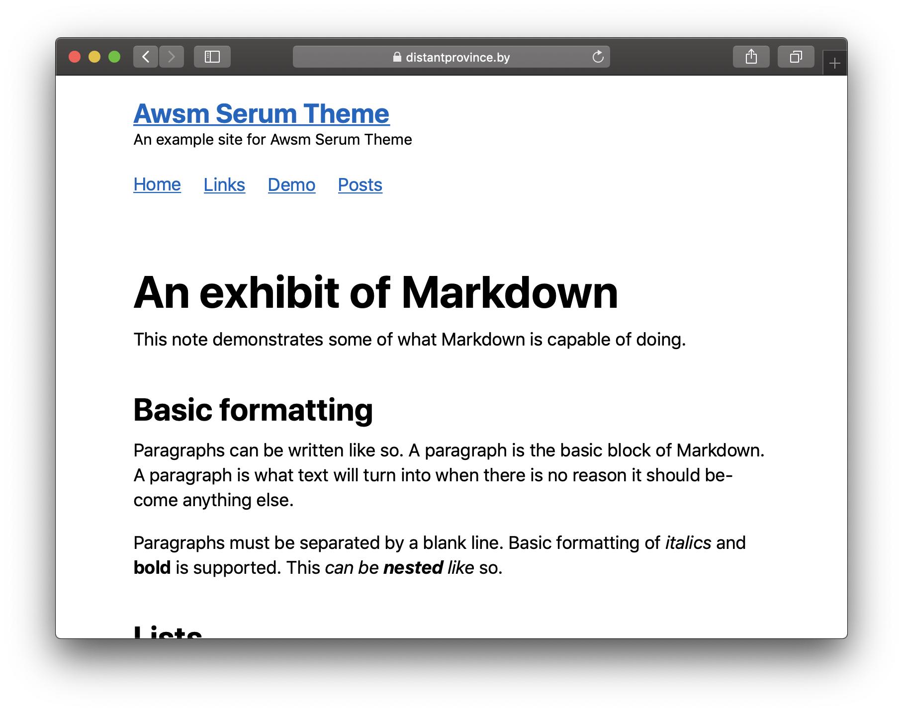

# Awsm Theme
Awsm Theme is a [Serum](https://github.com/Dalgona/Serum) meets [awsm.css](https://github.com/igoradamenko/awsm.css)

# [Example](https://distantprovince.by/awsm_example/)


# Installing theme
1. Add `serum-theme-awsm` to your `mix.exs`:
```
{:serum_theme_awsm, "~> 0.1"}
```
2. Configure Serum to use this theme in `serum.exs`
```
theme: Serum.Themes.Awsm
```
For more info please refer to the [Serum guide](https://dalgona.github.io/Serum/getting-started.html)

# Configuring awsm.css theme
Yeah, awsm.css has themes too...
1. Go to [awsm.css site](https://igoradamenko.github.io/awsm.css/) and choose color scheme you like
2. Create a file `includes/awsm_theme.html.eex` in your project and put a link to your chosen scheme's css file there:
```
<link rel="stylesheet" href="/assets/css/awsm_theme_black.css">
```